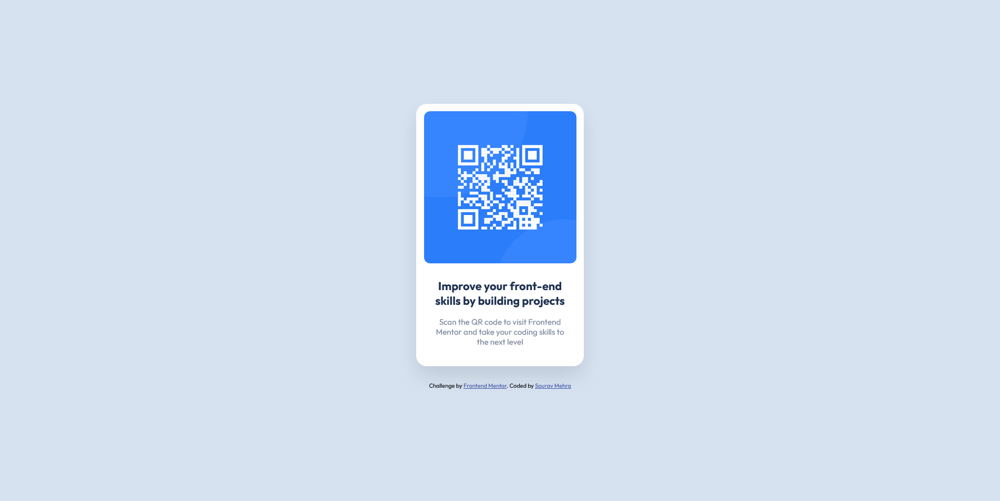

# Frontend Mentor - QR code component solution

This is a solution to the [QR code component challenge on Frontend Mentor](https://www.frontendmentor.io/challenges/qr-code-component-iux_sIO_H). Frontend Mentor challenges help you improve your coding skills by building realistic projects.

## Table of contents

- [Overview](#overview)
  - [Screenshot](#screenshot)
  - [Links](#links)
- [My process](#my-process)
  - [Built with](#built-with)
  - [What I learned](#what-i-learned)
  - [Continued development](#continued-development)
  - [Useful resources](#useful-resources) 
- [Author](#author)

## Overview

This challenge involves making a QR card component with a QR code picture in the upper half and a header and description text in the lower half. The card is centered, both vertically as well as horizontally, in the screen and has a very light shadow behind it.

### Screenshot



### Links

- Solution URL: [Add solution URL here](https://your-solution-url.com)
- Live Site URL: [Add live site URL here](https://your-live-site-url.com)

## My process

I started with visualizing roughly how many tags I'll be using, and the colors (whether it will be hard-coded or be through variables).

I then looked through what resources I had available in the style-guide.md file (should have done this first, will keep this in mind next time), and copied them to my CSS file.

I then started with coding the HTML file and putting the unstyled elements in to make a rough skeleton while also styling them side by side.

First I created the card component and re-sized it as close to the preview image as possible. Then I began with the QR code picture, fixed its size, and then finally started the text section. After this, I used the provided colors for BG and texts, while going through the finer details, like border radius, margins, box shadow, etc.

In the end, I moved my CSS file to 'assets/styles' from assets to structure it a bit more

### Built with

- Semantic HTML5 markup
- CSS custom properties
- Flexbox

### What I learned

This was my first attempt at coding something in front end on my own outside of work since 2 years. Following are some of the things I learned and experienced:

1. I had read many good things online about using rem (or root em) instead of px when defining sizes. This was my first time actually experiencing it. I had coded the whole challenge and at the final stage found my component's size a bit too big. Since I had coded this rem, I just had to manipulate the font-size in the :root pseudo class and everything adjusted on its own.

2. I found that matching my component's size and looks exactly to the preview image's was too time-consuming. It would have been much quicker if I had access to the Figma files. This shows the power Figma/Sketch or any design files have when coding, they provide you with a direction, a blueprint when you get stuck while coding, preventing you from thinking too much about trivial details.

3. The developer in the [video](https://youtu.be/JFyMWwOxHYM?t=761) I watched for this challenge's Netlify deployment said that the body's height should be calculated as calc(100vh - 1px) as this converts the units to px. This is done because using vh as height on mobile screens causes the components to re-adjust when the height changes, causing a jittery/shaky effect. I, however, didn't do this because I didn't see that jittery effect on my system, even in the mobile screen mode in the browser.

4. When I last deployed something on my own (~ 2 years ago), Heroku was the most famous tool for that. Nowadays, it's Vercel and Netlify seem to be more popular. I will be deploying my code on Netlify after a quick read-through of Vercel vs Netlify. It seems that Netlify is better for client-side, static applications, while Vercel is good for server-side rendering and back-end work.

5. I learned that :root pseudo class and html selector target the same element (<html>) in the document tree, but the :root pseudo class has a higher specificity.

6. I also learned the difference between importing multiple stylesheets in your html file vs using @import to import multiple stylesheets into a CSS file and importing that single stylesheet in your html file. Importing multiple stylesheets is useful for providing alternate stylesheets when you want to ensure that your app works on multiple browsers (Chrome, Firefox, Safari, etc.), while @import is useful when you want to use multiple stylesheets on an HTML page while including only a single link in the document's head.

```css
:root{
    `
    `
    `
    `
    font-size: 14.5px;
}

Helped me re-adjust the size of the component by making changes in just 1 place
```

### Continued development

- I've had a lot of practice with Flexbox. For the upcoming projects, I will pick up CSS Grid.
- Since this was a small project there was not much need for file structure management, but for bigger projects in the future, I want to be able to structure files according to the standards followed by developers so that anyone can easily go through and understand my code.
- I'll also start using Vue in the upcoming levels, and will also try my hand at Nuxt.js when I want to play with server-side rendering.

### Useful resources

- [QR Code Component - Frontend Mentor Challenge](https://youtu.be/JFyMWwOxHYM?t=761) - This helped me learn that mobile screens can get shaky if I use vh for height which is dynamic, instead of px, which is static.
- [MDN Web Docs - :root](https://developer.mozilla.org/en-US/docs/Web/CSS/:root) - This is the official MDN documentation describing the :root pseudo class and how it's different from the html selector.
- [What's the Difference Between @import and Link for CSS?](https://www.thoughtco.com/difference-between-important-and-link-3466404#:~:text=Linking%20is%20the%20first%20method,one%20style%20sheet%20into%20another.) - This is where I learned when to use multiple <links> vs when to use @import.

## Author

- Frontend Mentor - [@mehra-sourav](https://www.frontendmentor.io/profile/mehra-sourav)
- Twitter - [@Souravmehra](https://www.twitter.com/Souravmehra)
